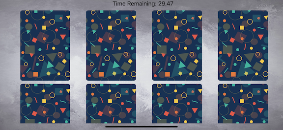

#  Match Game

## Find the correct pairs of cards before the timer runs out.

### Starting screen

### Try to match the cards

### When matched, the 2 cards will disappear

### If the player doesn't find all the cards in time, they lose.

### If they win, a pop up alerts them that they've won

### Building the code within Apple's Xcode IDE

### Create image and icon assets in Figma. All icons from Icons8.com. Icons are from Pixabay, Clker-Free-Vector-Images

### Import into Xcode

